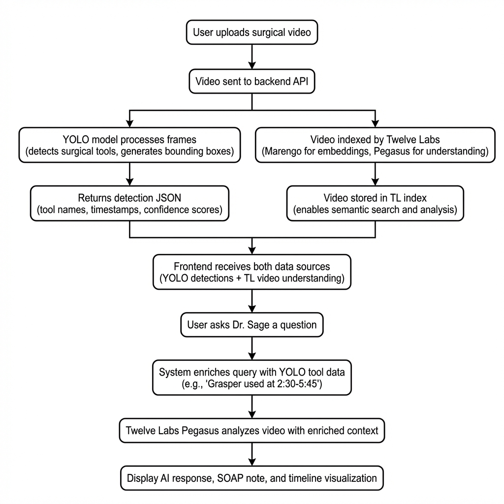
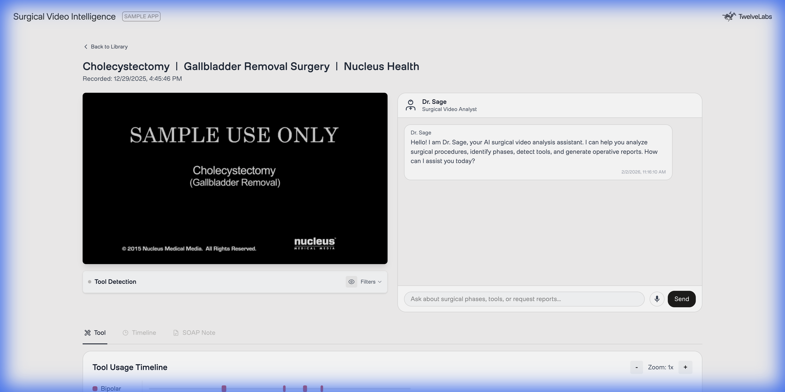
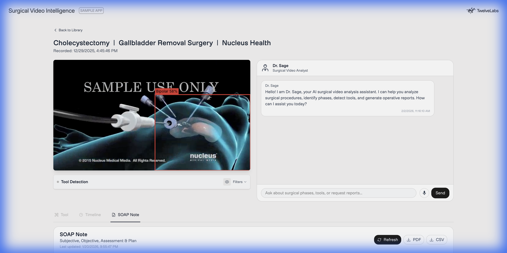
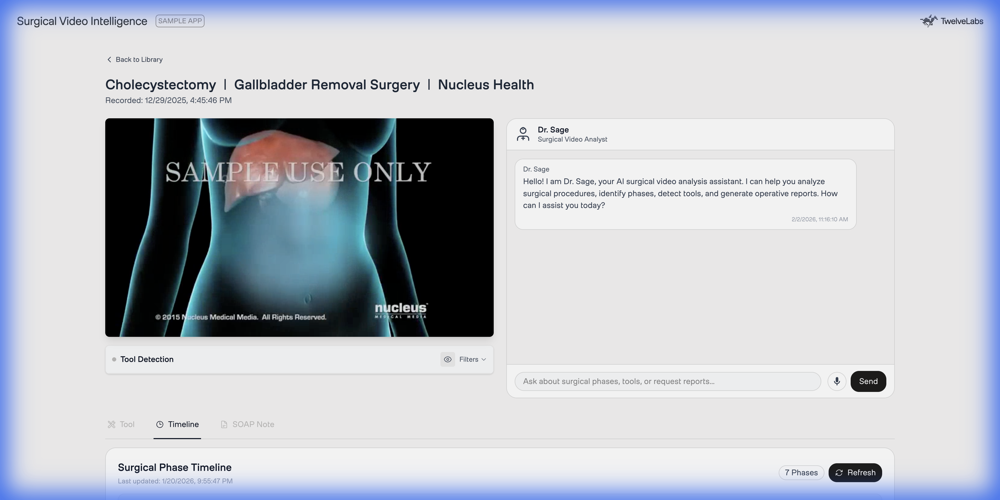
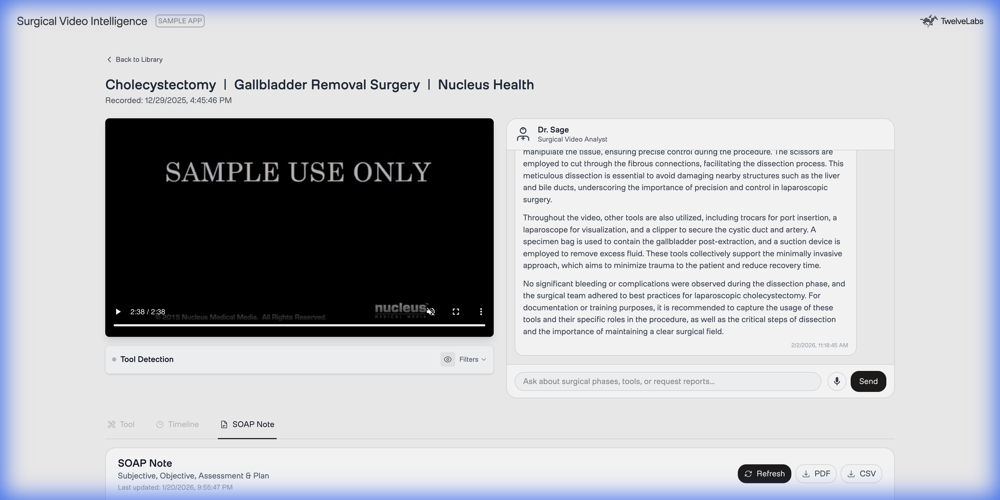
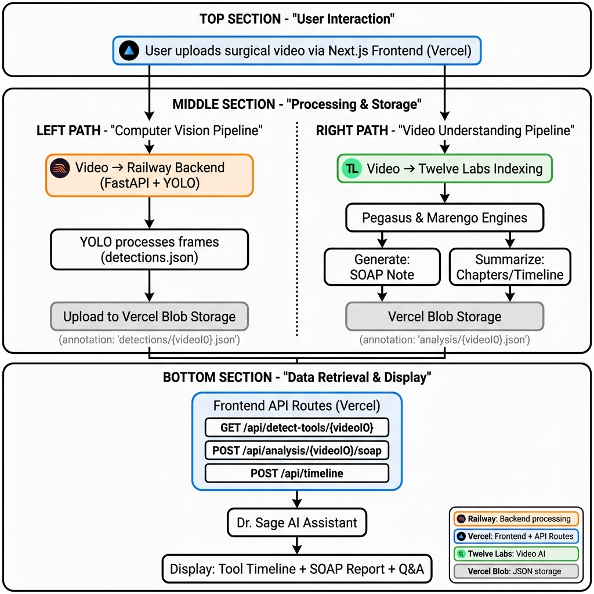

# Building a Surgical Video Intelligence Platform with Twelve Labs and YOLO

**Author**: [Your Name]
**Date**: [Current Date]
**Topic**: AI, Computer Vision, Surgical Robotics, Video Understanding

---

In the high-stakes world of surgery, video analysis is a critical tool for training, quality assurance, and post-operative review. Yet, for many institutions, this process remains surprisingly manual—surgeons and residents spend countless hours watching footage frame-by-frame to log instruments, identify phases, and write operative reports.

In this tutorial, we’ll build **Surgical Video Intelligence**, an automated platform that treats surgical video as a rich, queryable dataset. By combining **YOLO (You Only Look Once)** for real-time object detection with **Twelve Labs' multimodal video understanding API**, we can create a system that not only "sees" which tools are being used but "understands" the context of the surgery to generate expert-level operative notes.

> **What We're Building**: A Next.js application that automatically:
> 1. **Detects surgical tools** in real-time with bounding boxes and timestamps
> 2. **Generates SOAP operative notes** from video evidence
> 3. **Segments surgeries into chapters** (e.g., "Dissection," "Closure")
> 4. **Enables semantic search** across videos (e.g., "find all cauterization moments")
> 5. **Bonus**: Provides "Dr. Sage," an AI assistant for follow-up Q&A

## The Problem with One-Shot Analysis

Traditional surgical video analysis usually falls into one of two buckets:
1.  **Computer Vision Only**: Good at drawing boxes around tools, but lacks context. It knows a "clipper" is present but doesn't know *why*.
2.  **LLM Only**: Good at text generation, but blind to specific visual details unless they are manually described in a prompt.

Our solution fuses these approaches. We use a fine-tuned YOLO model to extract precise "hard data" (tool timestamps and locations) and feed that structured data into the Twelve Labs Pegasus model. This gives the AI a "ground truth" to reference when generating summaries, resulting in far higher accuracy and specific evidence citations.

## System Architecture

Our application follows a hybrid architecture where the "eyes" (Computer Vision) and the "brain" (Multimodal LLM) work in parallel.



1.  **Video Ingestion**: The user uploads a laparoscopic surgery video.
2.  **Tool Detection**: A YOLOv8 model (trained on 7 distinct surgical tools) scans the video and outputs a JSON file of detections.
3.  **Video Indexing**: The video is indexed by Twelve Labs to enable semantic search and analysis.
4.  **Context Fusion**: When the user asks a question, we inject the YOLO tool data into the prompt, allowing the Twelve Labs model to "know" exactly when specific tools were used.

## Application Demo

Before diving into the code, let's examine the four core automated features of the platform.

### 1. Real-Time Tool Detection
The main analysis view provides a synchronized experience. On the left, the video player overlays real-time tool bounding boxes detected by YOLO. On the bottom, a "swimlane" timeline visualizes exactly when each instrument interacts with the patient. This allows surgeons to identify efficiency gaps—for instance, noting if the *irrigator* was used excessively, implying bleeding.



### 2. Automatic SOAP Note Generation
Upon video upload and indexing, the system **automatically** generates a first-person operative note using the Twelve Labs Analyze API, enriched with YOLO tool detection data. No manual input required.



### 3. Surgical Phase Segmentation (Chapters)
The Twelve Labs Analyze API automatically breaks the surgery into distinct phases like "Preparation," "Dissection," and "Closure." These chapters appear on the timeline, enabling quick navigation to specific surgical stages.



### 4. Semantic Search (Marengo API)
Users can search for specific surgical moments using natural language. For example, searching "clipping of cystic artery" will return the exact video timestamp with a thumbnail, powered by Twelve Labs Marengo's multimodal embeddings.

**Example Query**: "Show me when the surgeon used electrocautery"
**Result**: Clips at 2:34-2:58 and 5:12-5:45 with 0.92 confidence

### Bonus: Dr. Sage (Auxiliary Q&A)
After the automated analysis is complete, users can ask **follow-up questions** to Dr. Sage, an AI assistant that has access to both the YOLO detections and Twelve Labs video understanding. This is useful for clarifications like "What tools were used during dissection?" or "Explain the technique used at 3:45."



## Deployment Architecture

Our application is designed as a distributed system with clear separation of concerns between compute-intensive tasks and user-facing operations.



### Infrastructure Overview

1.  **Frontend (Vercel)**: Next.js application serving the UI and API routes
2.  **Backend (Railway)**: FastAPI server running YOLO inference
3.  **Storage (Vercel Blob)**: Centralized JSON storage for all analysis results
4.  **AI Processing (Twelve Labs)**: Cloud-based video understanding

### The Data Flow

When a user uploads a surgical video, two parallel pipelines activate:

#### Computer Vision Pipeline (Railway)
1.  User uploads video → Frontend sends to Railway backend
2.  **YOLO processes the video** frame-by-frame (every 120th frame for efficiency)
3.  Backend generates `detections.json` containing:
    ```json
    {
      "detections": [
        {
          "frame": 120,
          "timestamp": 5.0,
          "tools": [
            {"class_name": "Grasper", "confidence": 0.95, "bbox": {...}}
          ]
        }
      ]
    }
    ```
4.  **Upload to Vercel Blob** at path: `detections/{videoId}.json`

#### Video Intelligence Pipeline (Twelve Labs + Vercel)
1.  Video is indexed by Twelve Labs (Marengo for embeddings, Pegasus for understanding)
2.  Frontend API routes trigger AI generation:
    *   **SOAP Note**: `POST /api/analysis/{videoId}/soap`
    *   **Chapters/Timeline**: `POST /api/timeline`
3.  Results are saved to Vercel Blob at: `analysis/{videoId}.json`

### Why This Architecture?

*   **Scalability**: Railway auto-scales for YOLO inference; Vercel handles traffic spikes
*   **Cost Efficiency**: YOLO runs only when needed; Blob storage is pennies per GB
*   **Simplicity**: No database required—JSON files in Blob are versioned and cacheable

## How Twelve Labs Powers Intelligence

While YOLO gives us the "what" and "when," Twelve Labs gives us the "why" and "how." Let's examine the three primary APIs we use: **Analyze** (SOAP generation & chapters) and **Search** (semantic retrieval).

### 1. Analyze API: SOAP Note Generation

The **Analyze API** is Twelve Labs' multimodal generation endpoint. We use it to create first-person operative notes.

**Code: `frontend/src/app/api/analysis/[videoId]/soap/route.js`**

```javascript
// 1. Fetch YOLO detection data from Vercel Blob
const toolData = await fetchToolDetection(videoId);

// 2. Format detections as readable text for the prompt
const toolContext = formatToolDetectionForPrompt(toolData);
// Example output: "DETECTED TOOLS: Grasper at 0:45, 1:20, 2:30..."

// 3. Enrich the SOAP generation prompt with hard data
const enrichedPrompt = `${soapPrompt}

## REFERENCE DATA
${toolContext}
Use this tool detection data to provide accurate tool names and usage times.`;

// 4. Call Twelve Labs Analyze API
const response = await getTwelveLabsClient().analyze({
    videoId: videoId,
    prompt: enrichedPrompt,
    temperature: 0.2 // Low temperature for factual, not creative, output
});

// 5. Parse JSON response and save to Vercel Blob
const parsedData = JSON.parse(response.data);
await saveToBlob(videoId, { operative_note: parsedData.operative_note });
```

**Why this works**: By injecting YOLO detections into the prompt, we prevent hallucinations. The AI can't claim "I used a clipper at 5:30" if YOLO never detected one.

### 2. Analyze API: Chapter Generation (Structured Output)

The **Analyze API** is also used for chapter generation by leveraging the `responseFormat` parameter to request structured JSON output. This provides structured, schema-validated output from the Analyze API.

**Code: `frontend/src/app/api/timeline/route.js`**

```javascript
const response = await getTwelveLabsClient().analyze({
    videoId: videoId,
    prompt: "Divide this surgery into distinct phases with medical terminology. For each phase, provide a title, summary, start time, and end time.",
    responseFormat: {
        type: "json_schema",
        jsonSchema: {
            type: "object",
            properties: {
                chapters: {
                    type: "array",
                    items: {
                        type: "object",
                        properties: {
                            chapterNumber: { type: "number" },
                            chapterTitle: { type: "string" },
                            chapterSummary: { type: "string" },
                            startSec: { type: "number" },
                            endSec: { type: "number" }
                        },
                        required: ["chapterNumber", "chapterTitle", "startSec", "endSec"]
                    }
                }
            }
        }
    }
});

// Parse the structured JSON response
const parsedData = JSON.parse(response.data);
// parsedData.chapters contains the chapter array
```

**Example output:**
```json
{
  "chapters": [
    {
      "chapterNumber": 1,
      "chapterTitle": "Preoperative Setup and Positioning",
      "chapterSummary": "Patient positioned and prepped for procedure",
      "startSec": 0,
      "endSec": 163
    },
    {
      "chapterNumber": 2,
      "chapterTitle": "Dissection and Control of Carotid Arteries",
      "startSec": 163,
      "endSec": 326
    }
  ]
}
```

**Key advantage**: The `responseFormat` parameter ensures the AI returns valid, parseable JSON matching your exact schema, eliminating the need for fragile string parsing.

### 3. Search API: Semantic Search with Marengo

The **Search API** uses Marengo's multimodal embeddings to find specific moments in the video based on natural language queries. Unlike keyword matching, this understands surgical context semantically.

**Code: `frontend/src/app/api/search/route.js`**

```javascript
const response = await getTwelveLabsClient().search.query({
    indexId: process.env.NEXT_PUBLIC_TWELVELABS_MARENGO_INDEX_ID,
    searchOptions: ['visual', 'audio'], // Search both modalities
    queryText: query, // e.g., "clipping of cystic artery"
    groupBy: "clip",
    threshold: "low" // Balance precision vs. recall
});

// Iterate through results
for await (const clip of response) {
    console.log(`Found at ${clip.start}s - ${clip.end}s (confidence: ${clip.confidence})`);
    console.log(`Thumbnail: ${clip.thumbnailUrl}`);
}
```

**Real-world use case**: A surgical educator searches for "use of monopolar coagulation" across 50+ training videos. Marengo returns all instances with timestamps, enabling rapid compilation of technique montages.

### Vercel Blob: The Central Nervous System

Both pipelines converge at **Vercel Blob**, a simple key-value store for JSON files. This design choice eliminates database complexity while maintaining fast lookups.

**Storage Schema:**
```
vercel-blob/
├── detections/
│   └── {videoId}.json    # YOLO outputs
└── analysis/
    └── {videoId}.json    # SOAP notes & chapters
```

**How Dr. Sage retrieves context (`frontend/src/app/api/analysis/route.js`):**
```javascript
// When user asks: "What tools were used for dissection?"
// 1. Fetch YOLO data from Vercel Blob (with Railway fallback)
const toolData = await fetchToolDetection(videoId);

// 2. Format detections into a readable summary for the AI
const toolContext = formatToolDetectionForChat(toolData);
// Output example:
// "[TOOL DETECTION DATA]
//  - Grasper: 450 detections (0:05 - 12:30)
//  - Hook: 120 detections (4:15 - 8:00)"

// 3. Enrich the user's query with tool context and call Twelve Labs directly
const enrichedQuery = toolContext ? `${userQuery}${toolContext}` : userQuery;

const response = await getTwelveLabsClient().analyze({
    videoId: videoId,
    prompt: enrichedQuery,
    temperature: 0.2
});
```

## Step-by-Step Implementation

### Prerequisites
*   **Node.js 18+** & **Python 3.10+**
*   **Twelve Labs API Key**: Get one from the [Playground](https://playground.twelvelabs.io/).
*   **Computed Vision Model**: We use a YOLOv8 model fine-tuned on the [Cholec80 dataset](http://camma.u-strasbg.fr/datasets), which contains 80 cholecystectomy surgeries.

### Step 1: Setting Up the Backend (Railway)

The YOLO detection backend is a FastAPI server that accepts video uploads and returns JSON detections.

**Key implementation details:**
```python
# backend/main.py
@app.post("/detect/upload")
async def detect_tools_upload(video_id: str, video: UploadFile):
    # Process video with YOLO
    results_data = run_inference(temp_video_path, video_id)

    # Upload results to Vercel Blob via Frontend API
    await upload_results_to_blob(video_id, results_data, blob_token)

    return {"status": "completed", "data": results_data}
```

The backend runs **120-frame skipping** (processing ~1 frame per 5 seconds at 24fps) to balance accuracy and speed.

### Step 2: Frontend API Routes (Vercel)

The Next.js API routes orchestrate the entire intelligence layer. Three key endpoints:

1.  **`GET /api/detect-tools/{videoId}`**: Retrieves YOLO detections from Vercel Blob
2.  **`POST /api/analysis/{videoId}/soap`**: Generates SOAP notes using Twelve Labs Analyze API (covered in detail above)
3.  **`POST /api/timeline`**: Creates chapter segmentation using Twelve Labs Analyze API

These routes follow a consistent pattern:
1.  Fetch YOLO data from Blob (if available)
2.  Call Twelve Labs API with enriched prompts
3.  Save results back to Blob for caching

### Step 3: Dr. Sage Chat Integration

The conversational interface enriches user queries with visual evidence before sending them to Twelve Labs.

**Implementation in `frontend/src/app/api/analysis/route.js`:**

```javascript
import { TwelveLabs } from 'twelvelabs-js';

// Helper: Convert raw JSON detections to a chat-friendly summary
function formatToolDetectionForChat(toolData) {
    // ... logic to aggregate frames into time ranges ...
    // Output example:
    // "- Grasper: 450 detections (0:05 - 12:30)"
    // "- Hook: 120 detections (4:15 - 8:00)"
    return summary;
}

export async function POST(request) {
    const { userQuery, videoId } = await request.json();

    // 1. Fetch the JSON data produced by our YOLO backend
    const toolData = await fetchToolDetection(videoId);

    // 2. Format it into natural language context
    // This turns thousands of data points into a readable summary for the AI
    const toolContext = formatToolDetectionForChat(toolData);

    // 3. Enrich the user's query
    // We explicitly tag this as "SYSTEM INJECTED DATA" so the model knows it's ground truth
    const enrichedQuery = toolContext
        ? `${userQuery}\n\n[SYSTEM INJECTED DATA - DO NOT IGNORE]\n${toolContext}`
        : userQuery;

    // 4. Call Twelve Labs Pegasus
    const client = new TwelveLabs({ apiKey: process.env.TWELVELABS_API_KEY });
    const response = await client.analyze({
        videoId: videoId,
        prompt: enrichedQuery, // The AI now "knows" the tools
        temperature: 0.2 // Low temperature for factual accuracy
    });

    return new Response(JSON.stringify(response));
}
```

### Step 4: Visualizing the Timeline

Raw data is useful for the AI, but humans need visuals. We mapped the detection timestamps to a React timeline component. Each "swimlane" represents a surgical instrument.

*   **Red**: Bipolar (Cautery)
*   **Green**: Hook (Dissection)
*   **Yellow**: Grasper (Manipulation)

This allows a surgeon to instantly see, for example, "Why was the Clipper used so early?" and click that exact moment to verify. The frontend simply maps the JSON array `detections` to distinct CSS positioning on the timeline bar.

## Challenges & Optimizations

Building this distributed hybrid system came with interesting challenges:

1.  **Data Synchronization**: Video players work in seconds, but ML models work in frames. We had to ensure precise conversion (`frame_count / fps`) so the bounding boxes didn't "drift" over long surgeries.
2.  **Context Window Limits**: A 2-hour surgery generates megabytes of JSON data. We solved this by aggregating adjacent frames into "usage blocks" (e.g., "Grasper used from 10:00 to 10:45") instead of feeding every single frame to the LLM.
3.  **Latency & Cost**: Running YOLO in the browser was too slow. Offloading to Railway with 120-frame skipping reduced processing time by 95% while maintaining medical accuracy.
4.  **Storage Strategy**: Using Vercel Blob instead of a traditional database eliminated connection pooling issues and reduced infrastructure complexity. JSON files are cached at the CDN edge for instant retrieval.

## Conclusion

By combining the **precise utility** of classic Computer Vision with the **reasoning capabilities** of modern Video LLMs, we've built a tool that is greater than the sum of its parts.

*   **YOLO** provides the *Who* and *When* (Specific tools, exact timestamps).
*   **Twelve Labs** provides the *What* and *Why* (Phase recognition, technique analysis).

This hybrid approach moves us closer to "Surgical 2.0," where AI doesn't just record video, but actively helps surgeons learn, improve, and ensure patient safety.

---

**Resources**:
*   [GitHub Repository](https://github.com/mrnkim/surgical-tool-detection)
*   [Twelve Labs Docs](https://docs.twelvelabs.io)
*   [Ultralytics YOLOv8](https://docs.ultralytics.com)
